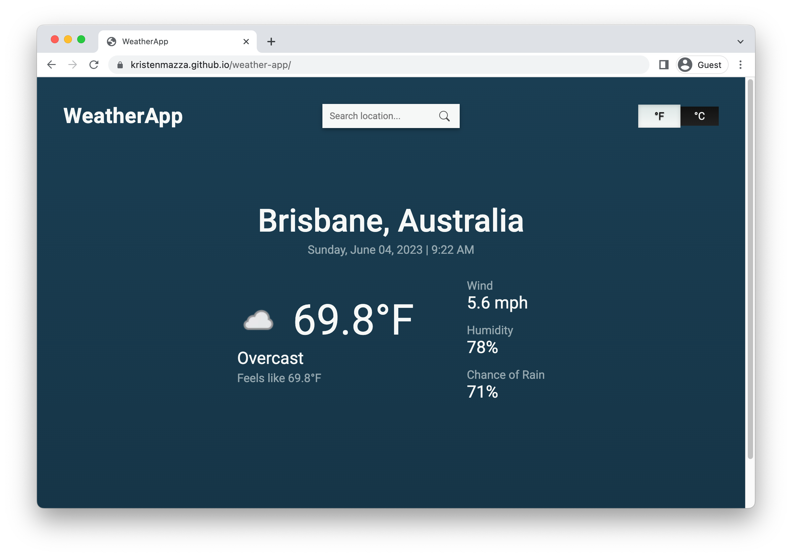

# Weather App

[Live Demo](https://kristenmazza.github.io/weather-app/) :point_left:

Search cities worldwide to get current weather information. Switch between imperial and metric system.

# Built Using

- JavaScript
- CSS
- Public API to get data
- Third-party library for date and time formatting
- Webpack

# Set Up Instructions

1. Install dependencies (`npm install`)
2. Generate assets (`npm run build`)
3. Run server (`npm start`)
